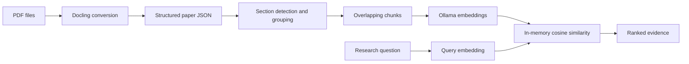

# Scientific Literature Assistant

A local semantic search system for navigating scientific literature.

The goal is simple: when a researcher remembers *"I read this somewhere..."*, the system searches across a collection of scientific papers and retrieves the most relevant paper and text chunk.

## What It Does

- Processes multiple scientific papers from a local collection
- Detects and preserves paper sections
- Splits text into overlapping, section-aware chunks
- Generates local embeddings using Ollama
- Retrieves relevant chunks using cosine similarity
- Preserves document, section, page, and chunk metadata for traceable results

## Current Capabilities

- Convert PDFs in `data/papers/` into structured Docling JSON files.
- Detect abstracts, numbered sections, and appendices in the exported paper structure.
- Filter layout furniture, footnotes, and very short text blocks.
- Group extracted text by section while preserving page numbers.
- Split sections into overlapping chunks with configurable size and overlap.
- Generate document and query embeddings locally with Ollama.
- Rank chunks from multiple papers with cosine similarity.
- Print document, section, page, chunk, character-offset, similarity, and text metadata with each result.
- Detect common PDF extraction artifacts such as spaced decimals, line-break hyphenation, suspicious concatenated tokens, and spaced scientific terms.
- Normalize Unicode and whitespace, and optionally ask an Ollama chat model to classify ambiguous extraction artifacts.

The project currently implements retrieval and evidence inspection. It does not yet generate final LLM answers, persist embeddings in a vector database, expose an HTTP API, or search the internet.

## Architecture



## Tech Stack

- Python 3.12+
- [Docling](https://github.com/docling-project/docling) for PDF document conversion
- [Ollama](https://ollama.com/) for local embeddings and optional artifact classification
- `nomic-embed-text:latest` for document and query embeddings
- `mistral-small:latest` for optional ambiguous-artifact classification
- NumPy for cosine-similarity calculations
- Standard-library modules including `pathlib`, `json`, `re`, and `unicodedata`

## Project Structure

```text
Scientific-Literature-Assistant/
├── data/
│   ├── json/                         # Structured Docling JSON inputs
│   └── papers/                       # Source PDFs
├── src/
│   └── scientific_literature_assistant/
│       ├── artifact_detector.py      # Deterministic artifact detectors
│       ├── cleaning.py               # Text normalization and candidates
│       ├── chunking.py               # Section text to overlapping chunks
│       ├── citation.py               # Planned citation functionality
│       ├── config.py                 # Paths and model/chunk defaults
│       ├── embeddings.py             # Ollama embedding integration
│       ├── json_ext.py               # PDF to structured JSON conversion
│       ├── llm.py                    # Planned answer-generation module
│       ├── pipeline.py               # Processing and retrieval workflow
│       ├── ranking.py                # Planned ranking functionality
│       ├── retrieval.py               # Cosine-similarity retrieval
│       ├── structure.py              # Block filtering and section grouping
│       ├── web_search.py             # Placeholder for future web search
│       ├── api.py                    # Planned API module
│       └── main.py                   # Reserved application entry point
├── notebooks/                        # Exploratory notebooks
├── old/                              # Earlier experiments
├── tests/                            # Sample fixtures and exploratory scripts
├── pyproject.toml
└── README.md
```

## Getting Started

### Requirements

- Python 3.12 or newer
- Ollama installed and running locally
- Docling and the runtime Python dependencies installed

Pull the models used by the implemented features:

```bash
ollama pull nomic-embed-text:latest
ollama pull mistral-small:latest
```

### Installation

```bash
git clone <repository-url>
cd Scientific-Literature-Assistant

python3 -m venv .venv
source .venv/bin/activate
python -m pip install --upgrade pip
python -m pip install -e .
python -m pip install docling numpy ollama
```

The project metadata currently declares `pymupdf`, but the active PDF conversion code uses Docling. The explicit runtime install above reflects the modules imported by the current implementation.

## Usage

### Convert PDFs to JSON

Place PDFs in `data/papers/`, then run:

```bash
python -m scientific_literature_assistant.json_ext
```

Each PDF is converted to a same-stem JSON file in `data/json/`. Existing JSON files are skipped.

### Run the Retrieval Demo

Place structured Docling JSON files in `data/json/`, then run:

```bash
python -m scientific_literature_assistant.pipeline
```

The demo processes every `*.json` file in `data/json/`, creates embeddings in memory, and prints the top five results for the example query defined in `pipeline.py`.

The pipeline can also be called from Python:

```python
from scientific_literature_assistant.pipeline import retrieve_information

retrieve_information(
    "Where is the information about the simulation box?",
    top_k=5,
)
```

`retrieve_information` currently prints results rather than returning them. The lower-level `retrieve` function in `retrieval.py` returns ranked result dictionaries.

### Inspect PDF Extraction Artifacts

Run the deterministic candidate detectors against the sample JSON fixture:

```bash
python -m scientific_literature_assistant.artifact_detector
```

Run the cleaning and optional Ollama-assisted classification workflow:

```bash
python -m scientific_literature_assistant.cleaning
```

The cleaning workflow applies deterministic decimal-spacing fixes and asks `mistral-small:latest` to classify other candidates conservatively. It is an exploratory utility and is not currently connected to the retrieval pipeline.

## Data Format

The retrieval pipeline expects a Docling document export with a top-level `texts` array. Text items are expected to contain labels, text, parent references, content layers, and page provenance. Section headers are currently recognized in formats such as `1. Introduction` and `1: Introduction`.

Each generated chunk contains:

- `document`
- `chunk_id`
- `section_number`
- `section_title`
- `page_list`
- `start_index` and `end_index`
- `text`
- `embedding` after embedding generation

The default chunk size is 1,000 characters with 300 characters of overlap. These values and the Ollama model names are configured in `src/scientific_literature_assistant/config.py`.

## Implementation Notes

- Embeddings are recreated for every query and kept in memory; no vector store or embedding cache is implemented.
- Retrieval scans JSON files from the local `data/json/` directory.
- Page metadata is preserved at the grouped-section level, so `page_list` may contain multiple pages for a chunk.
- The command-line demo uses a hardcoded example query; query arguments and a web/API interface are not implemented yet.
- `api.py`, `main.py`, `llm.py`, `ranking.py`, and `citation.py` are reserved or placeholder modules.
- `web_search.py` is not an internet search implementation; it is currently a placeholder.
- The `tests/` directory currently contains fixtures and exploratory scripts rather than an automated test suite.

## Roadmap

- Add automated tests for extraction, chunk boundaries, artifact detection, and retrieval ranking.
- Add command-line query arguments and structured result output.
- Persist embeddings in a vector database.
- Add LLM-based answer generation grounded in retrieved passages.
- Implement citation formatting from preserved source metadata.
- Expose retrieval and question answering through FastAPI.
- Add academic web search and Docker deployment.

## Motivation

As a physicist working with scientific literature, I often encountered the problem of remembering an idea or result from a paper without remembering exactly where I had read it.

This project explores how a local retrieval pipeline can help solve that problem:

**Find the relevant paper. Find the relevant passage. Keep the evidence traceable.**
